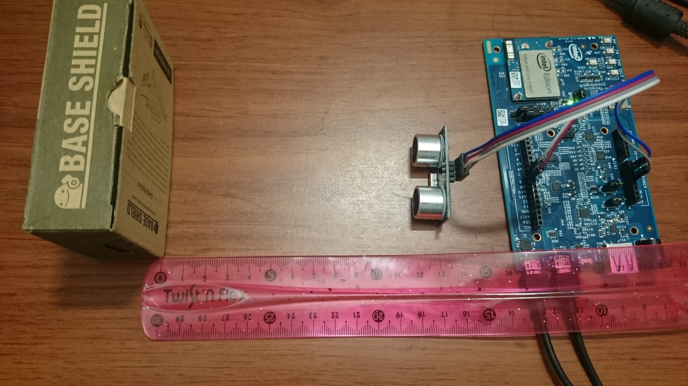
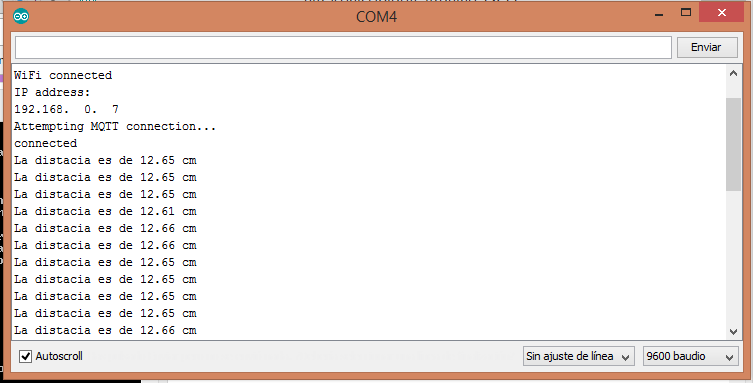
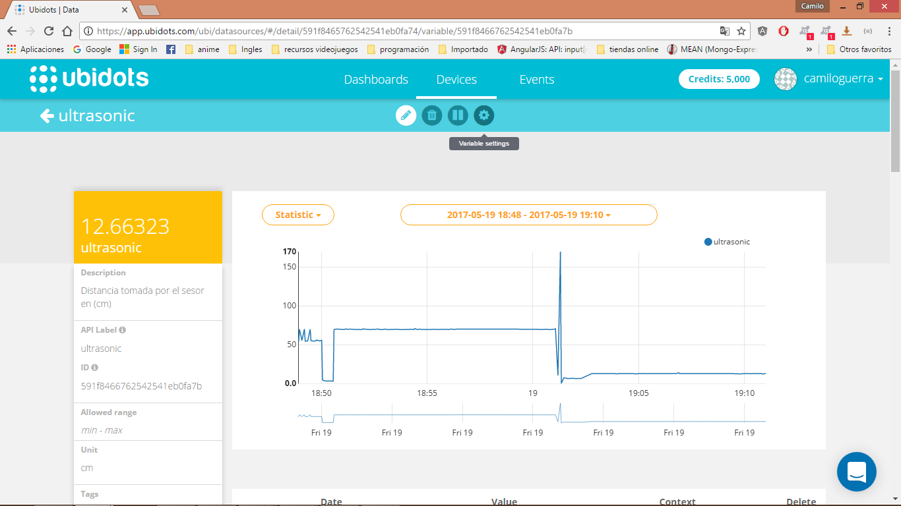
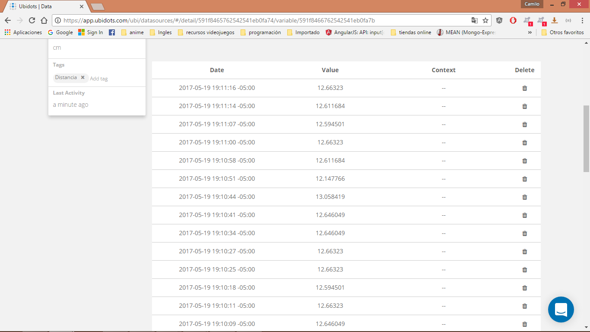

# Intel-Edison-UltraSonic Ranger 

-One Intel Edison
-One UltraSonic Ranger HC-SR04

Find distance bewteen an object and the sensor, provides 4cm - 300cm non-contact
measurement function.

1.ultrasensor folder contains only the sketch to read data from sensor.
2.sketchubidottest folder contains only the sketch to conect and send data to ubidots.
3.ultrasonicUbidots folder contains the skethc to send the dintance get from the sensor to ubidots.

Assembly Images:

Serial Arduino Data:

Ubidots Images: 

Data:

